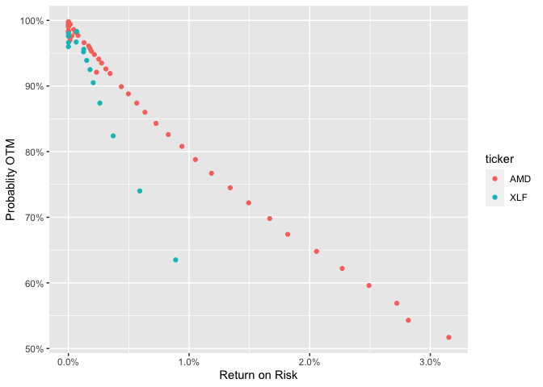

<!-- README.md is generated from README.Rmd. Please edit that file -->

# ROptionsStrategies

<!-- badges: start -->

[](https://travis-ci.com/pohnson/ROptionsStrategies)
<!-- badges: end -->

The goal of ROptionsStrategies is to utilize the flexibilities of R and
its vast libraries to analyze options data provided through TDAmeritrade
API. Although the only available strategy is short put (The Wheel,)
strategies such as spread, iron condor, and butterfly are in the
development roadmap.

## Installation

You can install the released version of ROptionsStrategies from
[CRAN](https://CRAN.R-project.org) WHEN IT IS AVAILABLE with:

``` r
#install.packages("ROptionsStrategies") Not available yet
```

And the development version from [GitHub](https://github.com/) with:

``` r
# install.packages("devtools")
devtools::install_github("pohnson/ROptionsStrategies")
```

## Authentication

The most important data point in this package is the TDAmeritrade’s
Consumer Key. If you haven’t had one yet, please follow this thorough
guideline to obtain one:
<a href="https://www.reddit.com/r/algotrading/comments/c81vzq/td_ameritrade_api_access_2019_guide/">link</a>.

## Wheel\_Extractor Function

Now, let’s assume that you already have one and save it in a csv file.
We then can read it like this.

``` r
library(ROptionsStrategies)
library(tidyverse)

consumer_key <- read_csv("consumer_key.csv") %>% as.character()
```

Let’s assume that you can only execute one Wheel trade and wonder if the
option should be AMD or XLF. You can use `wheel_extractor` to get
underlying data as follows:

``` r
data <- wheel_extractor(
  ticker = c('AMD', 'XLF'),
  expiration_date = '2021-08-06',
  consumer_key = consumer_key,
  sleep_second = 1
)
#> [1] "Requesting data for AMD"
#> [1] "Requesting data for XLF"
#> [1] "Finished requesting data from TDAmeritrade."

head(data)
#>    bid  delta strikePrice inTheMoney ticker prob_otm cash_inflow
#> 1 0.00 -0.002          55      FALSE    AMD    0.998           0
#> 2 0.00 -0.003          60      FALSE    AMD    0.997           0
#> 3 0.01 -0.006          65      FALSE    AMD    0.994           1
#> 4 0.00 -0.006          66      FALSE    AMD    0.994           0
#> 5 0.00 -0.009          67      FALSE    AMD    0.991           0
#> 6 0.00 -0.007          68      FALSE    AMD    0.993           0
#>   invested_capital return_on_risk expiration_date
#> 1             5500   0.0000000000      2021-08-06
#> 2             6000   0.0000000000      2021-08-06
#> 3             6500   0.0001538462      2021-08-06
#> 4             6600   0.0000000000      2021-08-06
#> 5             6700   0.0000000000      2021-08-06
#> 6             6800   0.0000000000      2021-08-06
```

But you can also parse data from another data frame using `$`:

``` r
data_ticker <- data.frame(
  ticker = c('AMD', 'XLF')
)

data2 <- wheel_extractor(
  ticker = data_ticker$ticker,
  expiration_date = '2021-08-06',
  consumer_key = consumer_key,
  sleep_second = 1
)
#> [1] "Requesting data for AMD"
#> [1] "Requesting data for XLF"
#> [1] "Finished requesting data from TDAmeritrade."

head(data2)
#>    bid  delta strikePrice inTheMoney ticker prob_otm cash_inflow
#> 1 0.00 -0.002          55      FALSE    AMD    0.998           0
#> 2 0.00 -0.003          60      FALSE    AMD    0.997           0
#> 3 0.01 -0.006          65      FALSE    AMD    0.994           1
#> 4 0.00 -0.006          66      FALSE    AMD    0.994           0
#> 5 0.00 -0.009          67      FALSE    AMD    0.991           0
#> 6 0.00 -0.007          68      FALSE    AMD    0.993           0
#>   invested_capital return_on_risk expiration_date
#> 1             5500   0.0000000000      2021-08-06
#> 2             6000   0.0000000000      2021-08-06
#> 3             6500   0.0001538462      2021-08-06
#> 4             6600   0.0000000000      2021-08-06
#> 5             6700   0.0000000000      2021-08-06
#> 6             6800   0.0000000000      2021-08-06
```

## Wheel Visualizer

Then you can use `wheel_visualizer` to inspect which stock at a given
risk (Probability OTM) has the highest return.

``` r
wheel_visualizer(
  data = data,
  include_in_the_money = FALSE
)
```


